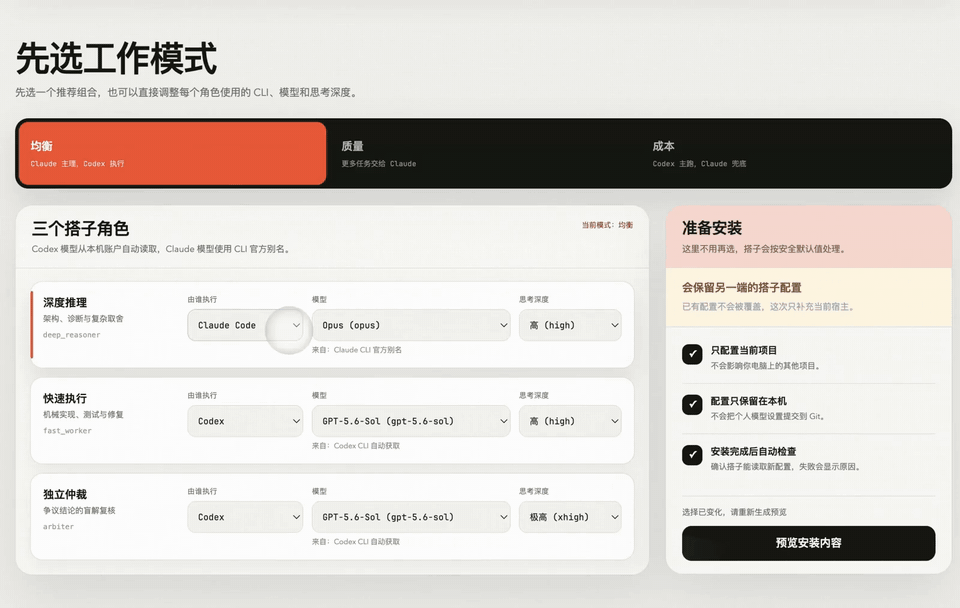
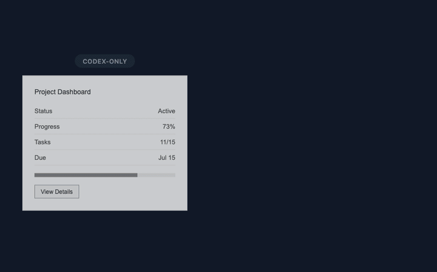
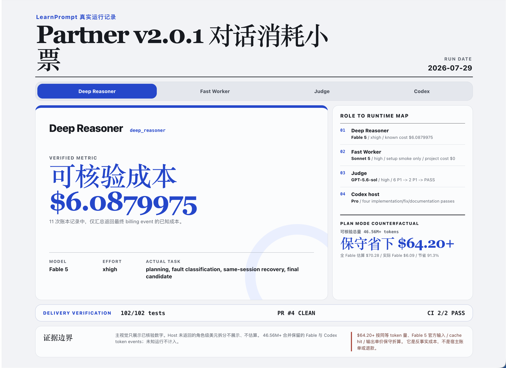
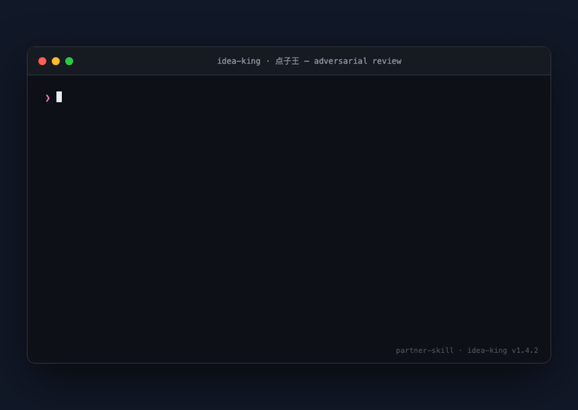

<sub>🌐 <a href="README.md">中文</a> · <b>English</b></sub>

<div align="center">

# Partner Skill

> My Claude Code and Codex are the best coding partners.

[](SKILL.md)
[](CHANGELOG.md)
[](https://github.com/LearnPrompt/partner-skill/stargazers)
[](LICENSE)

**Use Claude Code for planning, UI taste, and review. Use Codex for implementation and checks. v2.0.1 also makes repository-scale Fable planning bounded, recoverable, and auditable.**

[Install](#install) · [Showcase](#showcase) · [Use It](#use-it) · [Per-Host Usage](#per-host-usage) · [Cost Pressure Model](#cost-pressure-model) · [What It Solves](#what-it-solves) · [Safety](#safety) · [Verify](#verify)

</div>

---

## Install

One-line install with `npx`:

```bash
npx skills add LearnPrompt/partner-skill -g
```

Or ask your agent to install from GitHub:

```text
Please install Partner Skill: https://github.com/LearnPrompt/partner-skill
```

Manual local install:

```bash
git clone https://github.com/LearnPrompt/partner-skill.git
cd partner-skill
bash install.sh --target codex
bash install.sh --target claude
```

Before first real use, say "搭子，配置" (Partner, configure). Partner opens a local single-page UI bound only to `127.0.0.1`: balanced/quality/cost starting points plus every identity's concrete CLI/model/effort are handled in one place. The beginner flow fixes project scope, local Git exclusion, and post-install checks to safe defaults instead of asking advanced questions. The page shows the exact diff before confirmation. Codex models and per-model efforts come from the local CLI `model/list`; Claude aliases and efforts come from `claude --help`. Neither side is guessed.

<div align="center">
<p><strong>Configuration demo: switch operating mode, CLI, model, and reasoning effort</strong></p>
<a href="assets/config-switch-demo.mp4">

</a>
<p><a href="assets/config-switch-demo.mp4">Open the complete 7-second MP4</a></p>
</div>

## Showcase

**Showcase 1: same-session UI polish**

<div align="center">

</div>

Left: what Codex produces on its own — functional but visually forgettable. Right: the same card after Claude Code polishes it in the same session. The tiny `session: reused ✓` in the corner is the proof layer — no fresh Claude cold start.

**Showcase 2: a real Fable failure and recovery**

<div align="center">
<a href="assets/v2.0.1-conversation-cost-receipt.png">

</a>
<p><sub>Real webpage screenshot: switch roles to inspect the actual model, effort, task, cost, and delivery evidence.</sub></p>
</div>

This is a real fault chain, not an all-green demo. v2.0.1 does not promise that Fable never fails. It promises that failure is bounded, never triggers a silent model swap, and never turns partial output into a plan.

| Observed stage | Outcome | Cost returned by Claude CLI | Partner response |
|---|---|---:|---|
| v2.0.0 repository plan | Authentication worked; after spawning three subagents the stream idled, with no plan returned | `$6.57` | Exposed the unbounded legacy path |
| v2.0.1 fresh bounded attempt | No accepted event for 180 seconds; `idle_timeout`; no plan created | `unknown` (no final cost event) | Terminated the process group and kept metadata/checkpoint/recovery |
| Same-session resume | Exact `claude-fable-5` / `xhigh`; valid eight-section plan | `$0.382695` | Proved recovery without changing models |
| Final fresh candidate | Exact model/session, return code 0, matching packet/runner hashes | `$0.45282` | Became the final Judge and PR evidence |

These dollar values are costs returned by Claude CLI for the individual real planning runs, not a measured end-to-end token-savings rate. When a failed attempt has no final result event, the cost stays `unknown`. The [v2.0.0 failure-baseline receipt](examples/v2.0.0-conversation-cost-receipt.md) and [v2.0.1 complete conversation cost receipt](examples/v2.0.1-conversation-cost-receipt.md) record each identity's actual tasks, model, effort, and per-run cost. See [`docs/releases/v2.0.1.md`](docs/releases/v2.0.1.md), [`references/bounded-planning.md`](references/bounded-planning.md), and [`docs/showcase-cost-model.md`](docs/showcase-cost-model.md) for the evidence boundary.

## Use It

```text
Partner, use the same Claude Code session for planning first.
After Codex implements, send the diff back to that same session for UI polish
and /codex:review. End with a Partner Session Receipt showing whether
any fresh claude -p session was opened.
```

Short version:

```text
Partner: Claude plans, Codex implements, same-session review, then receipt.
```

First run, configure first:

```text
搭子，配置
```

Or open it directly from the repository:

```bash
bash install.sh --configure --host codex --repo /path/to/project
```

## Per-Host Usage

**Installed in Codex (Direction A, Codex-driven)**

```bash
bash install.sh --target codex
```

```text
Partner skill
```

Codex reads this SKILL.md and self-identifies as the `codex` host, following `references/codex-driven.md`: it orchestrates and implements, runs checks, and fixes details itself; Claude Code only plans, polishes the UI, and runs the final `/codex:review` — same Claude session reused, no repeated cold start.

**Installed in Claude Code (Direction B, Claude-driven)**

```bash
bash install.sh --target claude
```

```text
Partner, delegate the mechanical parts to Codex in the background, then full-review.
```

Claude Code reads this SKILL.md and self-identifies as the `claude_code` host, following `references/claude-driven.md`: plan, split the work, pass it through the Idea King adversarial gate, then hand mechanical or quota-pressure tasks to `delegate-codex.sh` background jobs, watch them with a loop, and full-review before accepting.

Host identity comes from who loaded this SKILL.md, not from who the prompt mentions — asking Claude Code to "let Codex do it" never makes it think it's Codex, and vice versa. Both sides' role model/effort share one `.partner/config.toml`; pick it once via the setup wizard above.

## Cost Pressure Model

Partner's savings come from avoiding repeated Claude cold starts. The waste typically happens after Codex edits: you open a new Claude session, and it has to rediscover the project, goal, and diff from scratch.

This README uses a showcase workload model, not API billing telemetry. Without reliable token logs, Partner does not invent token-savings numbers. The table is generated by `scripts/showcase-cost-ledger.py`; the source ledger is `examples/showcase-cost-ledger.json`.

| Without Partner | With Partner |
|---|---|
| Claude plans once, then a fresh Claude review session starts after Codex edits | One Claude Code session keeps the plan context |
| Each review re-explains the repo, goal, and diff | Codex sends a bounded handoff back to the same session |
| Token savings stay hand-wavy | The receipt says `new_claude_p_sessions: 0` |

Three operating modes:

| Mode | Codex carries | Claude Code carries | Claude pressure | Best for |
|---|---:|---:|---:|---|
| Codex-only | 100% implementation and checks | 0% | 0.0x, but lacks Claude UI / review taste | Low-risk tasks with no UI taste requirement |
| Partner | ~70% implementation, checks, fixes | ~30% planning, polish, review | 0.3x, while avoiding repeated cold starts | UI-heavy or feature-heavy tasks where Claude API cost matters |
| Pure Claude Code | 0% | 100% full workflow | 1.0x, including mechanical edits | Tiny tasks or when the user explicitly wants Claude to do everything |

Receipt example:

```text
[Partner session receipt]
phase: final fix
claude_session: 9836fe7e-4aca-47a6-83b5-69086b8db275
claude_session_reused: yes
new_claude_p_sessions: 0
codex_passes: 2
checks: bash scripts/check-skill-repo.sh .; jq schema check; git diff --check
anomalies: none
monitoring_level: full
```

When exact token telemetry is unavailable, Partner reports verifiable behavior: same Claude Code session reused, no fresh `claude -p`, checks passed, anomalies captured.

## What It Solves

You may already switch between Codex and Claude Code. The issue is not whether they can collaborate — it's that the workflow breaks down in practice:

- Claude Code is valuable for planning, UI taste, and review, but expensive for every mechanical edit.
- Codex is strong at implementation, long-context fixes, and running checks, but benefits from a second review perspective.
- The expensive failure mode is opening a new Claude session after Codex edits, forcing Claude to rediscover the repo.
- Users hear "I used Claude" but cannot see whether the workflow saved money.

Partner turns this into a protocol:

```text
Claude Code same session:
  plan -> polish -> /codex:review

Codex:
  implement -> verify -> monitor -> fix -> receipt
```

Since v1.4 Partner is bidirectional: with Claude Code as the driver, mechanical and quota-pressure tasks are delegated to Codex as background jobs while Claude monitors with a loop and full-reviews every result; the split itself must first pass the idea-king adversarial gate:

```text
Claude Code (driver):
  plan -> split (idea-king gate) -> delegate -> monitor loop -> full review -> receipt

Codex (background jobs):
  implement -> report -> bounded fix rounds on the same session
```

Execution has three channels, ordered by which meter they bill: the Partner background job (`delegate-codex.sh`, on the Codex subscription, with loop monitoring and resume rework) > a one-shot Codex subagent (a stuck-step assist) > a cheaper-Claude subagent (still billed to the Claude API, so it saves no quota). Quality-critical steps stay in Claude even though it is the expensive seat.

<div align="center">

</div>

Every split passes through Idea King first: verdict up front (ship / needs-attention / no-go), each attack tagged evidence or inference, each with the cheapest falsification experiment.

Host self-identification, not guessing: whichever runtime actually loaded this SKILL.md — Claude Code or Codex — is the host; mentioning the other agent in a prompt never switches identity. Role model/effort has exactly one source of truth, `.partner/config.toml` (project or global) — it does not get copy-pasted into prompts or docs.

## Trigger Prompts

```text
Partner skill
Use Claude Code goal for the plan, then Codex implements.
Use the same Claude Code chat for plan, polish, and /codex:review.
Let Claude skip this UI polish task, and Codex monitors it.
Run Codex Review inside Claude Code, then Codex fixes the findings.
Partner, resume the last task from .partner/ state.
Partner, delegate the mechanical parts to Codex in the background, then full-review.
搭子，配置
搭子，试跑
Partner, run the full protocol and deliver a PR.
This conclusion is contested — have the arbiter blind-solve it before we decide.
Idea King, run an adversarial review on this plan.
Idea King, grill me on this plan, one question at a time.
```

Chinese triggers such as `搭子` and `搭子.skill` are also first-class triggers.

## What It Delivers

- Clear routing: Claude Code plans, polishes, and reviews; Codex implements, monitors, verifies, and fixes.
- A cost-aware default: keep one Claude Code session for small and medium tasks.
- A bounded handoff: plan, changed files, diff stat, checks, risks, and only the snippets Claude needs.
- Monitoring evidence: PTY output, `claude agents --json`, transcript structure, optional task files, and repo checks — with `scripts/check-claude-cli.sh` probing what is actually available and a documented degradation path.
- A Session Receipt: proof of session reuse, fresh `claude -p` count, checks, anomalies, and monitoring level — machine-checkable via `scripts/validate-receipt.py`.
- Supporting tools: `scripts/make-handoff.sh` generates bounded handoffs and can persist them under `.partner/`; `references/failure-playbook.md` gives every anomaly a fixed recovery path; `references/scenarios.md` covers review-only, debugging, non-UI, non-git, monorepo, and multi-day tasks.
- Bounded Claude planning: Codex first prepares an evidence packet within 24,000 characters, then `scripts/run-claude-plan.py` invokes the configured Claude model/effort once with no tools or subagents and with wall/idle/API budgets. Success and failure both leave inspectable artifacts; the runner never substitutes a model silently.
- A Darwin-style ratchet: improve one workflow dimension at a time and keep only verified gains.
- A first-run setup wizard (`搭子，配置`): balanced/quality/cost presets remain editable per identity; `.partner/config.toml` is the single dual-host source of truth; beginner-safe defaults remove advanced setup questions; the exact diff is previewed before writing; models and efforts come from each CLI's real capability list; post-install verification uses a tool-free fresh Claude session plus the Codex delegate dry-run chain.
- Partner Session Receipt v2: adds `host`/`scope`/`config_source`/`roles_used` fields, so the receipt proves which model and effort actually ran a role, not just "Claude was used."
- An opt-in full protocol (`references/goal-to-pr.md`): Plan→Goal→PR→Verification, running unattended up through merge-ready + preview verified; merge, production, tags, force-push, deletion, destructive migration, and external publish each still need their own explicit imperative.

## File Map

```text
SKILL.md                                Runtime instructions for Codex/Claude-compatible agents
README.md                               Chinese entrypoint
README.en.md                            English entrypoint
install.sh                              Local installer for Codex, Claude Code, Agents, or all targets
test-prompts.json                       Trigger and behavior regression prompts
docs/showcase-cost-model.md             Showcase cost-pressure model and real token capture fields
docs/receipt-schema.json                JSON schema for the Partner Session Receipt (partner.receipt.v1)
docs/config-schema.md                   Partner config schema v2: identity matrix, precedence, concurrency, TOML subset
examples/session-receipt.md             Minimal visible proof of same-session reuse
examples/v2.0.0-conversation-cost-receipt.md
                                        Identity, model, effort, and cost receipt for the v2.0.0 failure baseline
examples/v2.0.1-conversation-cost-receipt.md
                                        Real task, model, effort, and cost receipt for all three identities
examples/showcase-cost-ledger.json      Cost-pressure ledger for the three operating modes
references/monitoring.md                How Codex monitors Claude Code progress
references/handoff-template.md          Bounded context packet for Claude Code polish/review
references/failure-playbook.md          Fixed recovery path per anomaly and .partner/ state persistence
references/scenarios.md                 Flow variants for review-only, debugging, non-UI, non-git, monorepo, multi-day
references/darwin-ratchet.md            Validation-gated improvement rules
references/codex-driven.md              Direction A: Codex-driven flow (Default Flow / Session Strategy / Permission Policy)
references/claude-driven.md             Direction B: five-phase Claude-driven delegation flow
references/setup.md                     "搭子，配置" first-run setup wizard: identity matrix (three cross-vendor identities) + second-host merge
references/tryout.md                    "搭子，试跑" identity tryout: one micro-task per identity, report proving the models are live
references/goal-to-pr.md                Opt-in full protocol: Plan→Goal→PR→Verification, hard-stop list, imperative authorization
references/goal-template.md             Template for .partner/goal.md (task table + checkpoint rule)
references/fable5-principles.md         Shared frontier-model prompting rules (why-forward, effort, checkpoint, resume)
references/bounded-planning.md          Input contract, tool-free boundary, budgets, and recovery for repository-scale Claude planning
references/memory-protocol.md           Wrap-up memory protocol (claude-mem / mem0 / auto-memory / rollout)
scripts/showcase-cost-ledger.py         Rebuilds the showcase cost-pressure ledger
scripts/check-readme-parity.py          Checks that Chinese and English READMEs stay aligned
scripts/check-skill-repo.sh             Publish readiness smoke check
scripts/check-claude-cli.sh             Probes Claude Code CLI monitoring capabilities, prints MONITORING_LEVEL
scripts/make-handoff.sh                 Generates a bounded handoff from live repo evidence, can persist to .partner/
scripts/make-receipt.py                 Generates a pre-validated receipt, auto-fills monitoring_level, can persist to .partner/
scripts/session-snapshot.sh             Transcript snapshot diff so the new-session count is computed, not claimed
scripts/validate-receipt.py             Validates Partner Session Receipt fields and values
scripts/run-test-prompts.py             Static checks plus experimental live mode for the regression prompts
scripts/run-claude-plan.py              Runs the bounded configured Claude planner and saves sanitized events/checkpoint/cost
scripts/delegate-codex.sh               Codex background-job primitive: submit / status / result / resume / cancel
scripts/partner-config.py               Config engine: TOML-subset parsing, deterministic writes, locking (schema v2)
scripts/partner_runtime.py              Shared Claude child-process environment boundary for first-party OAuth
scripts/partner-setup.py                Setup wizard engine: --preview/--apply/--rollback/--smoke/--status/--interactive
scripts/partner-setup-ui.py             Localhost single-page setup UI: full model matrix, exact preview, confirmed apply
scripts/goal-sync.py                    Hash-checked .partner/goal.md read/write: concurrent writes abort instead of silently losing updates
tests/test_partner_config.py            Config engine unit tests (round-trip / lock / precedence chain)
tests/test_partner_setup.py             Setup engine unit tests (idempotence / overwrite refusal / managed block / rollback)
tests/test_partner_setup_ui.py          Local UI state, preview binding, and write-gate unit tests
tests/test_delegate_role.py             Unit tests for --role injection and the override chain
tests/test_goal_sync.py                 goal.md concurrency unit tests (stale-hash writes rejected, no silent lost update)
tests/test_run_claude_plan.py           Bounded-planner input, config, budget, timeout, and no-fallback unit tests
idea-king/SKILL.md                      Idea King: first-principles decomposition + adversarial review (installs with Partner)
idea-king/README.md                     Idea King standalone notes and methodology credits
```

## Safety

- Do not send `/goal` through `claude -p`; `/goal` is an interactive Claude Code command.
- Use `skip` / `bypassPermissions` only when the user explicitly asks or when the worktree is isolated.
- Skip mode does not allow commit, push, deploy, publish, external messages, or secrets access by default.
- Do not use a fresh `claude -p` final review by default. Continue or resume the same Claude Code session first.
- Do not change repo visibility, tag releases, publish to registries, or announce externally without explicit permission.
- Do not use `git reset --hard` as the default rollback path. Prefer reviewable diffs or reverts.
- `.partner/config.toml` is not tracked by Git by default (added to `.git/info/exclude`, your `.gitignore` is untouched); the Codex side never invents a model name — detection failure is a clear error, waiting for you.
- The managed routing block (the persistent routing section it can write into CLAUDE.md/AGENTS.md) is off by default; all five ways its markers can be corrupted are refused with an explanation, never guessed at.
- The full protocol (Plan→Goal→PR→Verification) is no exception: merge, production, tags, force-push, deletion, destructive migration, and external publish each need their own explicit imperative — an earlier "continue" never covers them.

## Verify

```bash
bash scripts/check-skill-repo.sh .
python3 scripts/check-readme-parity.py
python3 -m unittest discover tests
jq -r '.[].id' test-prompts.json
SOURCE_DATE_EPOCH=1782921600 python3 scripts/showcase-cost-ledger.py
```

These checks also run automatically on every push and pull request via GitHub Actions (`.github/workflows/checks.yml`).

## License

MIT

---

<div align="center">

**更多好用 Skill · More Skills** → [learnprompt.pro/skills](https://learnprompt.pro/skills/)

[鲁班·Skill打磨](https://github.com/LearnPrompt/luban-skill) · [庖丁·博主蒸馏](https://github.com/LearnPrompt/paoding-skill) · [蔡伦·对话造纸](https://github.com/LearnPrompt/cailun-skill) · [阿福·LLM Todo](https://github.com/LearnPrompt/afu-llm-todo) · [愚公·Loop工程](https://github.com/LearnPrompt/loop-engineering) · [搭子·结对开发](https://github.com/LearnPrompt/partner-skill) · [AI雷达·零API资讯](https://github.com/LearnPrompt/ai-news-radar)

[淘金小镇·ClawHub日榜](https://github.com/LearnPrompt/skillrush-town) · [Irasutoya·正文配图](https://github.com/LearnPrompt/carl-irasutoya-illustrations) · [Humanize PPT·演讲系统](https://github.com/LearnPrompt/humanize-ppt) · [CC Harness·六件套](https://github.com/LearnPrompt/cc-harness-skills) · [微信读书教练](https://github.com/LearnPrompt/carl-weread) · [X Article发布](https://github.com/LearnPrompt/x-article-publisher-skill)

<sub>**[LearnPrompt](https://github.com/LearnPrompt) 出品** · 公众号「卡尔的AI沃茨」 · [X @aiwarts](https://x.com/aiwarts)</sub>

<sub>Acknowledgment: the done_when / anti-Goodhart / imperative-authorization vocabulary in `references/goal-to-pr.md` draws on [愚公·Loop工程](https://github.com/LearnPrompt/loop-engineering)'s goal-forging.md and guardrails.md (vocabulary and invariants only — not its YAML format or ceremony).</sub>

</div>
