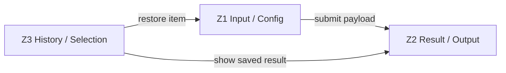
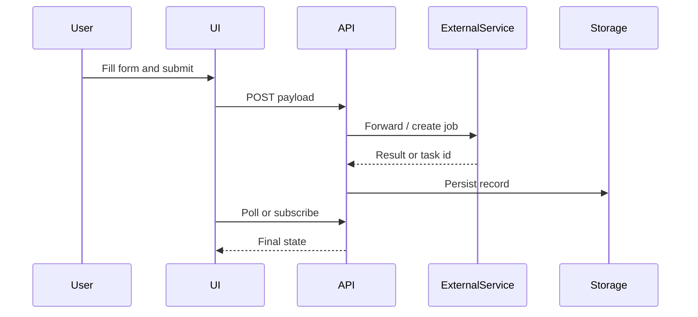
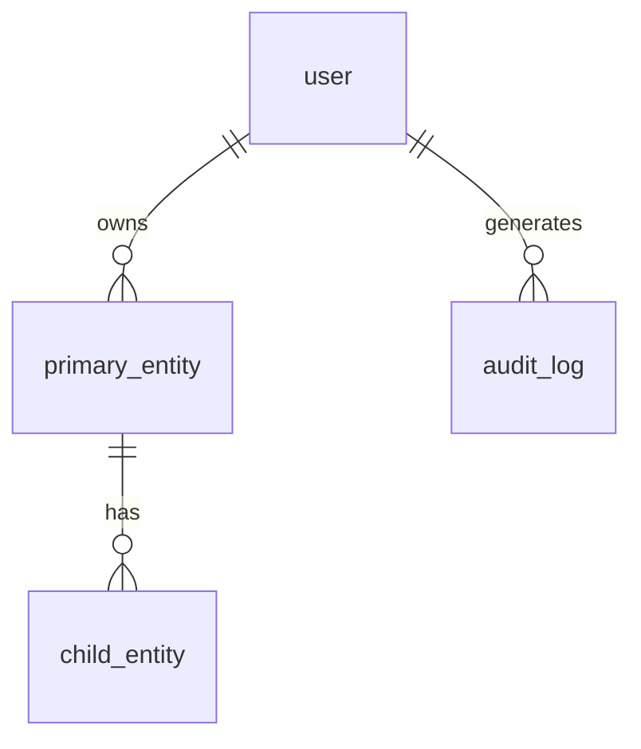
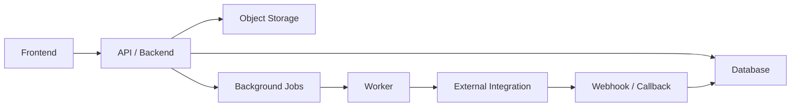

# Website Replication Deliverable Template

Use this structure for an implementation-ready replication report. Keep claims tied to evidence. "Competitor" below means *the reference site being audited* — it may also be a legacy product, partner integration, or inspiration source.

Adapt section depth to the competitor's domain (SaaS / e-commerce / content / collaboration / AI tool / marketplace / internal tool). Remove sections that do not apply and say so explicitly rather than leaving empty tables.

## 1. Scope

- Competitor:
- Target product / repo:
- Pages and states inspected:
- Date / time inspected:
- Auth state:
- Differentiation direction:
- Access limits:

## 2. Evidence

Only include redacted evidence. Do not expose cookies, authorization headers, session IDs, tokens, customer data, uploaded contents, private messages, account identifiers, or one-time URLs.

Keep the entire raw `audit/` tree ignored. A custom raw root must be outside Git or pass `git check-ignore -q -- <raw-root>` in its containing worktree before capture. Publish only a separately reviewed and sanitized copy outside the raw root.

| Evidence | Path / URL | Source | Redaction | Notes |
| --- | --- | --- | --- | --- |
| Desktop screenshot |  | observed |  |  |
| Mobile screenshot |  | observed |  |  |
| Focused component screenshot |  | observed |  |  |
| DOM / text dump |  | observed |  |  |
| Network log / API trace |  | observed |  |  |
| Interactive inventory | `audit/<site-slug>/snapshots/<date>/<page>-inventory.md` | observed | raw/local | DOM-enumerated, stable IDs; any published copy is separately sanitized |

### Interaction Coverage

| Metric | Value |
| --- | --- |
| Interactive elements enumerated | N |
| Probed | M |
| Coverage | M / N (X%) |
| Hidden-state passes completed | hover · keyboard · right-click · drag · scroll · input-edge · network · url-history · multi-window |

The configured threshold is 90% by default. Implementation-ready output fails whenever coverage is below it, even when blockers are documented. Use documented blockers for a research/blocker report and list every un-probed element here.

#### Reflection round

Three things most likely to have been missed (per Workflow step 8), and the result of probing each:

| # | Suspected miss | Probed result |
| --- | --- | --- |
| 1 |  | observed / inferred / blocked / confirmed-absent |
| 2 |  | observed / inferred / blocked / confirmed-absent |
| 3 |  | observed / inferred / blocked / confirmed-absent |

## 3. Executive Gap Summary

| Priority | Area | Gap | Impact | Source | Confidence | Recommendation |
| --- | --- | --- | --- | --- | --- | --- |
| P0 |  |  |  | observed / documented / inferred | high / medium / low |  |
| P1 |  |  |  | observed / documented / inferred | high / medium / low |  |
| P2 |  |  |  | observed / documented / inferred | high / medium / low |  |

## 4. UI System

### Visual Tokens

| Token | Competitor | Target Recommendation | Source |
| --- | --- | --- | --- |
| Background |  |  | observed |
| Panel |  |  | observed |
| Accent |  |  | observed |
| Text |  |  | observed |
| Radius |  |  | observed |
| Spacing scale |  |  | observed |
| Font family |  |  | observed |

### Component Inventory

| Component | Competitor Behavior | Target Component | Status | Source | Notes |
| --- | --- | --- | --- | --- | --- |
|  |  |  | matched / different by design / missing / blocked / not applicable |  |  |

### Representative Component Example

Demonstrate only the *structural pattern* using the target brand's own tokens and copy. Do not paste competitor class names, exact spacing values, copy, or distinctive composition. Skip this block if no reusable pattern is worth documenting.

```html
<!-- target-brand markup illustrating the pattern, not a copy of competitor markup -->
```

```css
/* tokens / layout primitives only */
```

```js
// event/state pattern only when non-obvious
```

## 5. Page Region Relationship Model

Use [region-model-template.md](region-model-template.md). Do not stop at visual labels like "left panel" or "right panel"; describe each region's product responsibility and relationships.

### Region Map

| Zone ID | Region Name | Evidence / Selector | Visual Position | Purpose | Owns State | Consumes State | Emits Events | Updates | Source | Confidence |
| --- | --- | --- | --- | --- | --- | --- | --- | --- | --- | --- |
| Z1 |  | screenshot / DOM / inventory IDs |  |  |  |  |  |  | observed / inferred | high / medium / low |

### Region Layout Constraints

| Region | Placement | Anchor Target | Positioning Mode | Sizing Rule | Scroll Behavior | Layering / Containment | Responsive Transform | Collision Rules | Evidence | Source | Confidence |
| --- | --- | --- | --- | --- | --- | --- | --- | --- | --- | --- | --- |
| Z1 | bottom / left / overlay | viewport / parent / sibling / safe area | normal-flow / fixed / sticky / docked | fill / intrinsic / min-max | fixed during scroll / sticky within container / independently scrollable | inline / overlay / z-layer / reserves space | desktop side panel -> mobile bottom sheet | avoids keyboard / safe-area / bottom nav | screenshot + bbox + computed style | observed / inferred | high / medium / low |

### Region Dependency Matrix

| From Region | Event / Data | To Region | Trigger | Target State Change | API / Storage Dependency | Evidence |
| --- | --- | --- | --- | --- | --- | --- |
| Z1 | form payload | Z2 | submit | empty -> loading -> result/error |  |  |

### Region Relationship Graph



### Region State Contracts

| Region | Empty | Ready | Loading | Success | Error | Disabled / Gated |
| --- | --- | --- | --- | --- | --- | --- |
| Z1 |  |  |  |  |  |  |
| Z2 |  |  |  |  |  |  |

### Stateful Region Matrix

Use this for app/tool pages where the same regions change after user action. It prevents preserving an initial empty/examples region after the reference switches to generated content, history, folders, or task queues.

| State | Primary Region | Secondary / Result Region | Bottom / Global Controls | Persistence Needed | Source | Notes |
| --- | --- | --- | --- | --- | --- | --- |
| Empty / examples |  |  |  | local / session / account / workspace / none | observed / documented / inferred |  |
| In progress / loading |  |  |  |  |  |  |
| Completed / history |  |  |  |  |  |  |
| Filtered / selected |  |  |  |  |  |  |
| Mobile |  |  |  |  |  |  |

## 6. Interaction Matrix

Rows below are *examples* of common interactions to consider. Replace with the actual user actions in scope; do not leave generic placeholders in the final deliverable.

### Control Intent Ledger

Use this table for primary, secondary, icon-only, picker, saved-item, and result-routing controls. See [parity-trap-ledger.md](parity-trap-ledger.md). A control with missing intent, safety classification, authorization/rollback boundary, auth state, persistence, region effect, or verification evidence belongs in the gap list. Re-enumerate consequential confirmation UI: keep its opener observed, and record the final commit control as a separate `✗` / `blocked:` inventory row unless explicitly authorized in a safe test environment.

| Control ID | Region | Visible Affordance | Safety Class | Authorization / Rollback | Observed Trigger | Complete Observed Outcome | Auth States | Persistence Class | Backend / API Mapping | Cross-Region Updates | Post-Submit / Result Effect | Target Requirement | Test / Browser Evidence | Remaining Gap |
| --- | --- | --- | --- | --- | --- | --- | --- | --- | --- | --- | --- | --- | --- | --- |
| i000 | Z1 |  | read-only / reversible / consequential |  | click / hover / keyboard |  | logged-out / logged-in / quota / paid | local / session / account / workspace / shared |  |  |  |  |  |  |

| User Action | Source Region | Target Region | Competitor Result | Target Result | Status | Source | Confidence | Notes |
| --- | --- | --- | --- | --- | --- | --- | --- | --- |
| Primary CTA | Z1 | Z2 |  |  |  | observed / documented / inferred |  |  |
| Mode / tab switch |  |  |  |  |  | observed / documented / inferred |  |  |
| Secondary action (clear / copy / save / expand) |  |  |  |  |  | observed / documented / inferred |  |  |
| Upload / select source |  |  |  |  |  | observed / documented / inferred |  |  |
| Submit / confirm |  |  |  |  |  | observed / documented / inferred |  |  |
| Post-submit / result action |  |  |  |  |  | observed / documented / inferred |  |  |
| Gated state (auth / quota / paywall) |  |  |  |  |  | observed / documented / inferred |  |  |
| Menu / submenu action |  |  |  |  |  | observed / documented / inferred |  |  |
| Filter / sort / reset |  |  |  |  |  | observed / documented / inferred |  |  |
| Selection / bulk action |  |  |  |  |  | observed / documented / inferred |  |  |
| Global player / fixed control |  |  |  |  |  | observed / documented / inferred |  |  |
| Workspace / folder / collection change |  |  |  |  |  | observed / documented / inferred |  |  |

### Interaction Flow

Include a sequence diagram only when async work, third-party services, or background storage matters. Otherwise skip.



## 7. API And Backend Mapping

| Feature | Region / Contract | Competitor Field / Call | Target UI Field | Target API Payload | Integration Need | Status | Source | Confidence |
| --- | --- | --- | --- | --- | --- | --- | --- | --- |
|  | Z1 / C1 |  |  |  |  |  | observed / documented / inferred | high / medium / low |

### Observed / Documented Endpoints

| Method | Route | Request Shape | Response Shape | Auth Class | Source | Notes |
| --- | --- | --- | --- | --- | --- | --- |
| POST |  | redacted | redacted |  | observed / documented |  |
| GET |  | redacted | redacted |  | observed / documented |  |

### Blocked Or Unknown API Work

| Gap | Why Blocked | Evidence | Preparation Needed |
| --- | --- | --- | --- |
|  | missing docs / auth / paid access / private target API |  |  |

### Persistence And Hydration Matrix

Fill this whenever the audited workflow has saved folders, lists, history, reactions, item movement, filters, preferences, or other user state.

| State | Scope | Competitor Persistence | Target Persistence | API / Schema Need | Hydration Risk | Status | Source |
| --- | --- | --- | --- | --- | --- | --- | --- |
| Folder / workspace / collection | local / session / account / workspace / shared |  |  |  |  | matched / different by design / missing / blocked / not applicable | observed / documented / inferred |
| Item assignment / move-to |  |  |  |  |  |  |  |
| Like / dislike / favorite |  |  |  |  |  |  |  |
| Filter / sort / search preference |  |  |  |  |  |  |  |
| History / generated result |  |  |  |  |  |  |  |

## 8. Data Model

Replace the example entities below with the actual domain. Common shapes by product type:

- **SaaS / collaboration**: users, organizations, workspaces, members, primary domain object, activity log.
- **E-commerce**: users, products, variants, carts, orders, payments, shipments.
- **Content / publishing**: users, posts, media, collections, comments, subscriptions.
- **AI / generative tool**: users, projects, jobs, assets, prompts, credits.
- **Marketplace**: buyers, sellers, listings, transactions, reviews.
- **Internal tool**: users, roles, records, events, audit log.



### Core Tables

| Table | Purpose | Key Fields | Region / State Link |
| --- | --- | --- | --- |
|  |  |  |  |

## 9. Architecture Recommendation

Only fill rows that the audit's evidence supports. Mark out-of-scope rows `not applicable`.

| Layer | Recommendation | Reason | Source | Confidence |
| --- | --- | --- | --- | --- |
| Frontend framework |  |  | observed / documented / inferred |  |
| State management |  |  | observed / documented / inferred |  |
| UI system |  |  | observed / documented / inferred |  |
| Backend / API |  |  | observed / documented / inferred |  |
| Database |  |  | observed / documented / inferred |  |
| File / object storage |  |  | observed / documented / inferred |  |
| Background jobs / queue |  |  | observed / documented / inferred |  |
| External integrations |  |  | observed / documented / inferred |  |
| Auth / permissions |  |  | observed / documented / inferred |  |
| Billing / quota |  |  | observed / documented / inferred |  |
| Observability |  |  | observed / documented / inferred |  |



## 10. Replication PRD Handoff

Use [prd-template.md](prd-template.md) for the full PRD. The PRD is required for implementation-ready work.

### Product Objective

- User problem:
- Success outcome:
- Non-goals:

### Region Requirement Index

| Region | Requirement Section | Required Contracts | Acceptance Summary |
| --- | --- | --- | --- |
| Z1 | PRD section link | C1, C2 |  |
| Z2 | PRD section link | C1, C3 |  |

### Cross-Region Contract Index

| Contract ID | Trigger Region | Trigger | Target Region | Required State Change | API / Data Dependency | Acceptance |
| --- | --- | --- | --- | --- | --- | --- |
| C1 | Z1 | submit valid form | Z2 | empty -> loading -> result/error |  |  |

## 11. Implementation Plan

| Step | Work | Readiness | Acceptance | Verification |
| --- | --- | --- | --- | --- |
| 1 |  | can implement now / needs preparation |  |  |
| 2 |  | can implement now / needs preparation |  |  |
| 3 |  | can implement now / needs preparation |  |  |

## 12. Verification Checklist

- [ ] Screenshot evidence captured for competitor and target.
- [ ] Evidence is redacted; no secrets, private data, or one-time URLs.
- [ ] Raw evidence root is outside Git or ignored by its containing worktree; every published copy was separately reviewed and sanitized.
- [ ] Interactive inventory generated without truncation; coverage M / N meets the configured threshold (90% by default).
- [ ] All hidden-state passes completed or marked `not applicable` with reason.
- [ ] Reflection round (3 likely-missed candidates) probed and recorded.
- [ ] Page region relationship model completed with `Z*` IDs.
- [ ] Every major region has purpose, owned state, consumed state, emitted events, updates, and responsive behavior.
- [ ] Region Layout Constraints captured for desktop and mobile: Placement, Anchor Target, Positioning Mode, Scroll Behavior, Layering / Containment, Responsive Transform, and Collision Rules.
- [ ] Cross-region contracts exist for the primary user workflow.
- [ ] Component inventory complete.
- [ ] Interaction matrix covers small controls and post-submit actions.
- [ ] Stateful region matrix covers empty/examples, in-progress, completed/history, filtered/selected, and mobile states where applicable.
- [ ] API mapping separates observed / documented / inferred / blocked / missing.
- [ ] Persistence matrix classifies local/session/account/workspace/shared state and identifies required schema/API/policy work.
- [ ] Hydration risks are checked for visible counts, labels, selected folders/workspaces, filters, dates, random values, and client-only storage.
- [ ] Data and architecture diagrams included when backend work matters; otherwise marked not applicable.
- [ ] Blocked backend / API work is separated from ready implementation work.
- [ ] Replication PRD exists for implementation-ready work and contains testable acceptance criteria.
- [ ] Tests cover new UI behavior and payload mapping (when working in a repo).
- [ ] Tests cover persistence and the exact state transition that caused the parity miss.
- [ ] Build / typecheck / lint passed.
- [ ] Desktop and mobile visual checks passed, including overlap checks for sticky CTAs, global players, pagination, and sidebars.
- [ ] Missing backend work is documented, not silently removed from scope.
